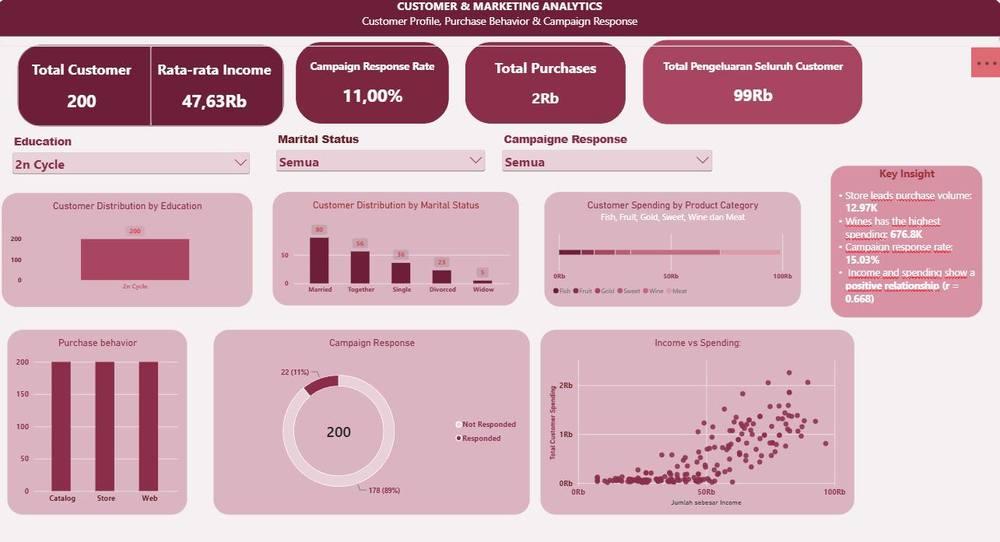

# Customer & Marketing Analytics
Interactive Power BI dashboard analyzing customer profiles, purchase behavior, spending patterns, and marketing campaign response.

## Tools
- Power BI
- Power Query
- DAX
- CSV

## Dashboard Preview

## Key Insights
- Store memiliki jumlah pembelian tertinggi: 12,97K
- Wines memiliki total pengeluaran tertinggi: 676,8K
- Tingkat respons campaign: 15,03%
- Income dan spending memiliki hubungan positif (r = 0,668)

## Analysis Areas
- Customer Profile
- Purchase Behavior
- Product Category Spending
- Marketing Campaign Response
- Income vs Customer Spending

## Project Objective
The dashboard was developed to provide an interactive overview of customer characteristics, purchasing behavior, spending patterns, and campaign response to support data-driven marketing analysis.
